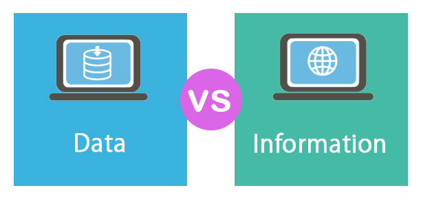

## 0. Başlamadan Önce

Bu dersin amacı, her hafta işlenecek olan **SQL**, **NoSQL**, **veri bilimi**, **veri mühendisliği** ve **veri mimarisi** gibi konularda uzmanlık seviyesine ulaşmak değildir. Bunun yerine, bu ders; bu alanlara yeni adım atan veya derinleşmeye başlayan katılımcıların, temel ve orta düzeyde birçok bilgiyi öğrenmelerini ve duymalarını hedefler.

Ders boyunca, öğrencilerin bu konulara dair önemli kavramları kavramalarını sağlamak, ayrıca kariyerlerinde ihtiyaç duyabilecekleri **yol haritalarını** daha net bir şekilde görebilmelerine yardımcı olmak temel amaçlarımızdandır.

## 1. Veri ve Bilgi Arasındaki Fark

## Giriş
Veri yönetiminin kökeni, insanlık tarihinin çok eski dönemlerine dayanır. İşte veritabanlarına giden yolculuğun önemli durakları:
- **M.Ö. 3500:** Mezopotamyalılar, bilgilerini kil tabletlerde tutmaya başladı.
- **M.S. 105:** Çinli Cai Lun, modern kağıt yapımını geliştirerek verilerin kayıt altına alınmasını kolaylaştırdı.
- **1440:** Johannes Gutenberg, matbaayı icat ederek bilginin geniş kitlelere ulaşmasını hedefledi.
- **1801:** Joseph Marie Jacquard, delikli kartları icat etti ve veri işleme fikrinin temelini attı.
- **1890:** Herman Hollerith, ABD Nüfus Sayımı’nda delikli kartları kullanarak veri işleme devrimini başlattı.
- **1960:** Charles Bachman, ilk ağ tabanlı veri tabanı olan Integrated Data Store’u geliştirdi.
- **1970:** Edgar Codd, ilişkisel veritabanı modelini tanıttı; bu, modern veritabanlarının temelini oluşturdu.
- **1979:** Oracle, ticari ilişkisel veritabanlarını piyasaya sürdü.
- **2000’ler:** Büyük veri kavramı ortaya çıktı ve NoSQL gibi ilişkisel olmayan veritabanları yaygınlaştı.
- **2010’lar:** Bulut tabanlı veritabanları, veri yönetiminde yeni bir dönem başlattı.

## Arthur Rimbaud:

Arthur Rimbaud, genç yaşta olağanüstü şiirler yazarak edebiyat dünyasında derin izler bırakmış bir Fransız şairdir. Ancak 21 yaşına geldiğinde ani bir kararla şiir yazmayı tamamen bıra(kmıştır. 
- **Edebi Dönemi:** Ham verileri (kelimeler ve imgeler) işleyerek derin ve anlamlı şiirler (bilgi) üretti.
-  **Afrika Dönemi:** Doğrudan ham verilerle çalışarak pratik bilgiler elde etmeye odaklandı.

 **Alıntı: Batı Tefekkürü ve İslam Tasavvufu (N. Fazıl Kısakürek)**
> İlâhi azameti her noktada görür olmuştu. "En küçük bir teşbih yapsam çıldıracağım, o hale geldim" diye bir notu vardır. Bırakıyor edebiyatı, bir coğrafya cemiyetine âza oluyor, Afrika'ya geçiyor. Bir tek kelime mecaz, teşbih, istihare kullanmadan kuru kuru raporlar veriyor. "Güneş battı, yağmur yağdı, şu oldu, bu oldu" gibi... Ve sonra otuzsekiz yaşlarında bir hastalığa tutuluyor, Marsilya'da ölüyor, ölürken son sözü şudur: "Allah Kerim..."

## Veri ve Bilgi 
### Veri (Data)
- **Tanım:** Ham, işlenmemiş gerçekler, rakamlar veya metin parçalarıdır. Tek başına anlam ifade etmeyebilir.
- **Özellikleri:**
	- Ölçülebilir ve kaydedilebilir.
	- Doğrudan bir anlamı olmayabilir.
- **Örnekler:**
	- “25”, “Ankara”, “Evet”, “2023-10-13”
### Bilgi (Information)
- **Tanım:** Verinin işlenmesi ve yorumlanması sonucunda elde edilen anlamlı ve kullanışlı çıktılardır.
- **Özellikleri:**
	- Karar verme süreçlerinde kullanılır.
	- Veriye anlam ve bağlam kazandırır.
- **Örnekler:**
	- “Ankara’da bugün hava sıcaklığı 25°C.”
	- “2023 yılında şirket satışları %10 arttı.”

### Veri ve Bilgi Arasındaki İlişki**
- **Dönüşüm Süreci:**
	1. **Veri Toplama:** Ham veriler toplanır. (Extract) 
	2. **Veri İşleme:** Veriler organize edilir ve analiz edilir. (Transform)
	3. **Bilgi Elde Etme:** İşlenen veriler anlamlı bilgiye dönüşür. (Load)
- **Önem:** Bilgi, verinin değerini ortaya çıkarır ve karar verme süreçlerini destekler.

### Veri'den Bilgi'ye

**Data** (Veri) → **Information** (Bilgi) → **Knowledge** (Değerli Bilgi) → **Wisdom** (Bilgelik)

### Veri Tipleri
#### **Yapılandırılmış Veri (Structured Data)**

- **Tanım:** Önceden tanımlanmış bir format veya modele uyan, kolayca aranabilen ve düzenlenebilen veridir.
- **Özellikleri:**
    - Tablo formatında saklanır (satırlar ve sütunlar).
    - Veri türleri ve alanlar önceden belirlenmiştir.
    - SQL gibi sorgulama dilleri ile kolayca işlenebilir.
- **Örnekler:**
    - Veritabanı tablolarındaki müşteri kayıtları.
    - Excel dosyalarındaki finansal veriler.
    - Sensörlerden gelen zaman damgalı ölçümler.

#### **Yapılandırılmamış Veri (Unstructured Data)**

- **Tanım:** Önceden belirlenmiş bir formatı olmayan, organize edilmemiş ve genellikle metin, resim, video gibi verilerden oluşan veri türüdür.
- **Özellikleri:**
    - Veriler farklı formatlarda olabilir (metin dosyaları, görüntüler, ses dosyaları).
    - Geleneksel veritabanları ile doğrudan işlenmesi zordur.
    - Analiz için özel araçlar ve teknikler gerektirir.
- **Örnekler:**
    - E-posta içerikleri.
    - Sosyal medya paylaşımları.
    - Görüntü ve video dosyaları.
    - Sensörlerden gelen ham veriler (örneğin, ses kayıtları).

#### **Yarı Yapılandırılmış Veri (Semi-Structured Data)**

- **Tanım:** Kısmen organize edilmiş, ancak tam olarak yapılandırılmış veri modellerine uymayan veri türüdür.
- **Özellikleri:**
    - Etiketler veya ayraçlar kullanılarak bazı yapısal bilgiler içerir.
    - XML, JSON gibi formatlarda saklanır.
- **Örnekler:**
    - JSON formatındaki API yanıtları.
    - XML dosyaları.
    - Log dosyaları.

#### **Yapılandırılmış ve Yapılandırılmamış Veri Arasındaki Farklar**

- **Depolama ve İşleme:**
    - Yapılandırılmış veri, ilişkisel veritabanlarında saklanır ve SQL kullanılarak işlenir.
    - Yapılandırılmamış veri, dosya sistemlerinde veya NoSQL veritabanlarında saklanır; işlenmesi için metin madenciliği, doğal dil işleme gibi teknikler kullanılır.
- **Esneklik:**
    - Yapılandırılmış veri esnek değildir; şema değişiklikleri zor olabilir.
    - Yapılandırılmamış veri esnektir; farklı format ve türde verileri saklayabilir.
- **Arama ve Sorgulama:**
    - Yapılandırılmış veri kolayca sorgulanabilir ve analiz edilebilir.
    - Yapılandırılmamış veri üzerinde arama ve analiz daha karmaşıktır ve özel araçlar gerektirir.

#### **Veri Dönüşümü ve Entegrasyonu**

- **Yapılandırılmamış Veriden Yapılandırılmış Veriye Dönüşüm:**
    - Metin madenciliği ve doğal dil işleme (NLP) teknikleri kullanılır.
    - Örnek: E-posta içeriklerinden müşteri şikayetlerinin kategorize edilmesi.
- **Önem:**
    - Kurumlar, yapılandırılmamış verilerden değerli bilgiler elde etmek için bu verileri işleyip yapılandırmalıdır.
    - Büyük veri çağında, veri çeşitliliğini yönetmek kritik bir beceridir. 

