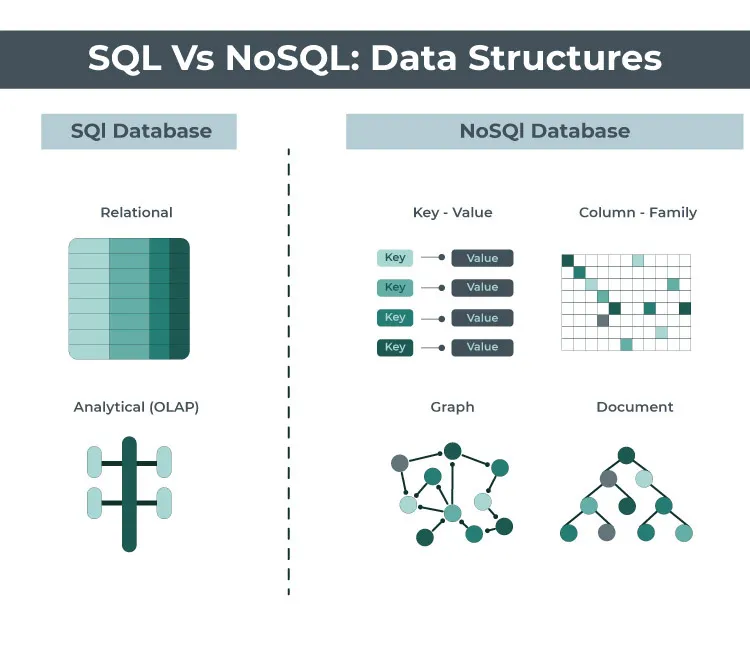

## 3. Veritabanı Türleri

### İlişkisel Veritabanları (Relational Databases)

**Tanım**
- Verileri tablolar halinde organize eden ve bu tablolar arasındaki ilişkileri tanımlayan veritabanlarıdır.
- **Sorgulama Dili:** SQL (Structured Query Language) kullanırlar.
	`SELECT * FROM Öğrenciler WHERE sinif="1A" AND devamsizlik>=17 `

**Özellikleri**
- **Tablolar:**
	- Satırlar (kayıtlar) ve sütunlardan (alanlar) oluşur.
- **Anahtarlar:**
	- **Birincil Anahtar (Primary Key):** Tablodaki her kaydı benzersiz olarak tanımlar.
	- **Yabancı Anahtar (Foreign Key):** Tablolar arasındaki ilişkileri belirtir.
- **Veri Bütünlüğü:**
	- **ACID Özellikleri:**
		- **Atomicity (Atomiklik):** İşlemler ya tamamen başarılı olur ya da hiç gerçekleşmez.
		- **Consistency (Tutarlılık):** İşlemler veri bütünlüğünü korur.
		- **Isolation (Yalıtım):** Eş zamanlı işlemler birbirini etkilemez.
		- **Durability (Dayanıklılık):** Tamamlanan işlemler kalıcıdır.

**Avantajları**
- **Veri Tutarlılığı ve Bütünlüğü:** Yüksek düzeyde veri bütünlüğü sağlar.
- **Standartlaştırılmış Sorgulama Dili:** SQL ile güçlü ve karmaşık sorgular yazılabilir.
- **Geniş Destek ve Kaynaklar:** Uzun süredir kullanılan bir teknoloji olduğu için geniş topluluk desteği vardır.

**Dezavantajları**
- **Ölçeklenebilirlik Sınırlamaları:** Büyük ölçekli ve dağıtık sistemlerde performans sorunları olabilir.
- **Esneklik Eksikliği:** Şema değişiklikleri zor ve maliyetli olabilir.
- **Yüksek Kaynak Gereksinimi:** Karmaşık işlemler için daha fazla donanım kaynağı gerekebilir.
### İlişkisel Olmayan Veritabanları (NoSQL Databases)
**Tanım**
- Tablo tabanlı olmayan, esnek şema yapısına sahip ve farklı veri modellerini destekleyen veritabanlarıdır.
- **NoSQL:** “Not Only SQL” ifadesinin kısaltmasıdır.

**Türleri**
1. **Anahtar-Değer Depoları (Key-Value Stores):**
	- **Tanım:** Verileri basit bir anahtar ve değer çifti olarak depolar.
	- **Örnekler:** Redis, Riak.
2. **Belge Tabanlı Veritabanları (Document Databases):**
	- **Tanım:** Verileri JSON, BSON gibi belge formatlarında saklar.
	- **Örnekler:** MongoDB, CouchDB.
3. **Sütun Ailesi Depoları (Column Family Stores):**
	- **Tanım:** Verileri sütun aileleri halinde depolar.
	- **Örnekler:** Cassandra, HBase.
4. **Grafik Veritabanları (Graph Databases):**
	- **Tanım:** Verileri düğümler ve kenarlar arasındaki ilişkiler şeklinde saklar.
	- **Örnekler:** Neo4j, OrientDB.

**Özellikleri**
- **Esnek Şema Yapısı:** Şemasız veya esnek şema ile hızlı geliştirme imkanı.
- **Yüksek Ölçeklenebilirlik:** Yatay ölçeklendirmeye uygundur.
- **Performans:** Büyük veri ve yüksek trafikli uygulamalarda hızlı okuma/yazma işlemleri.

**Avantajları**
- **Esneklik:** Veri yapısı kolayca değiştirilebilir.
- **Performans ve Ölçeklenebilirlik:** Dağıtık mimarilerde yüksek performans sunar.
- **Uygun Maliyet:** Daha az donanım gereksinimi ile büyük verileri işleyebilir.

**Dezavantajları**
- **Veri Tutarlılığı:** Tutarlılık genellikle erişilebilirlik ve bölünebilirlik lehine feda edilir (CAP Teoremi).
- **Sorgulama Karmaşıklığı:** Standart bir sorgulama dili yoktur; her veritabanının kendi sorgulama yöntemi olabilir.
- **Veri Bütünlüğü ve İlişkiler:** İlişkileri yönetmek geliştiricinin sorumluluğundadır.

