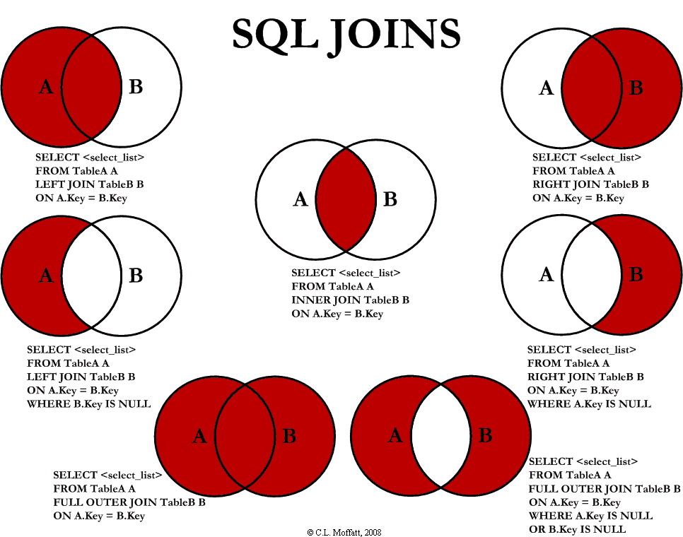

İleri SQL konuları, veritabanı işlemlerini daha karmaşık ve verimli hale getirmek için kullanılan gelişmiş sorgulama ve yönetim tekniklerini içerir. Bu bölümde aşağıdaki konulara değineceğiz:

-	JOIN İşlemleri
-	Alt Sorgular (Subqueries)
-	Gruplama ve Toplulaştırma Fonksiyonları
-	Pencere Fonksiyonları
-	Görünümler (Views)
-	Saklı Yordamlar (Stored Procedures)
-	Tetikleyiciler (Triggers)
-	İşlemler (Transactions)
-	İndeksleme ve Performans Optimizasyonu

### 4.1 JOIN İşlemleri
JOIN işlemleri, birden fazla tablodan veri çekmek ve bu verileri ilişkilerine göre birleştirmek için kullanılır.





#### 4.1.1 INNER JOIN
**Tanım:** Her iki tabloda da eşleşen kayıtları getirir.

```
SELECT 
    uyeler.isim, uyeler.soyisim, kitaplar.baslik
FROM 
    odunc
INNER JOIN uyeler ON odunc.uye_id = uyeler.uye_id
INNER JOIN kitaplar ON odunc.kitap_id = kitaplar.kitap_id;
```

#### 4.1.2 LEFT JOIN
**Tanım:** Sol tabloda bulunan tüm kayıtları ve sağ tabloda eşleşen kayıtları getirir.

```
SELECT 
    uyeler.isim, uyeler.soyisim, odunc.odunc_tarihi
FROM 
    uyeler
LEFT JOIN odunc ON uyeler.uye_id = odunc.uye_id;
```

#### 4.1.3 RIGHT JOIN
**Tanım:** Sağ tabloda bulunan tüm kayıtları ve sol tabloda eşleşen kayıtları getirir.
```
SELECT 
    kitaplar.baslik, odunc.odunc_tarihi
FROM 
    kitaplar
RIGHT JOIN odunc ON kitaplar.kitap_id = odunc.kitap_id;
```
#### 4.1.4 FULL OUTER JOIN
**Tanım:** Her iki tablodaki tüm kayıtları getirir; eşleşme yoksa NULL değerler kullanılır.

```
SELECT 
    uyeler.isim, uyeler.soyisim, odunc.odunc_tarihi
FROM 
    uyeler
FULL OUTER JOIN odunc ON uyeler.uye_id = odunc.uye_id;
```

### 4.2 Alt Sorgular (Subqueries)
Alt sorgular, bir sorgunun içinde başka bir sorgu çalıştırmak için kullanılır.

#### 4.2.1 WHERE İçinde Alt Sorgu
```
SELECT baslik, yazar
FROM kitaplar
WHERE kitap_id IN (
    SELECT kitap_id
    FROM odunc
    WHERE uye_id = 1
);
```

#### 4.2.2 FROM İçinde Alt Sorgu
```
SELECT avg_satis
FROM (
    SELECT AVG(satis_sayisi) AS avg_satis
    FROM kitap_satislari
) AS ortalama_satis;
```

### 4.3 Gruplama ve Toplulaştırma Fonksiyonları
Gruplama ve toplulaştırma fonksiyonları, verileri belirli kriterlere göre gruplandırmak ve bu gruplar üzerinde hesaplamalar yapmak için kullanılır.
#### 4.3.1 Toplulaştırma Fonksiyonları
-	**COUNT()**: Kayıt sayısını verir. 
-	**SUM()**: Toplam değeri verir.
-	**AVG()**: Ortalama değeri verir.
-	**MAX(), MIN()**: Maksimum ve minimum değerleri verir.
#### 4.3.2 GROUP BY

```
SELECT yazar, COUNT(*) AS kitap_sayisi
FROM kitaplar
GROUP BY yazar
HAVING COUNT(*) > 1;
```
#### 4.3.3 HAVING

```
SELECT yazar, COUNT(*) AS kitap_sayisi
FROM kitaplar
GROUP BY yazar
HAVING COUNT(*) > 1;
```
### 4.4 Pencere Fonksiyonları
Pencere fonksiyonları, SQL sorgularında sonuç kümesi üzerinde bir dizi satırı dikkate alarak hesaplamalar yapmanıza olanak tanır. Bu fonksiyonlar, bir sonuç kümesinin bir bölümünde sıralama, gruplama ve diğer hesaplamalar yaparken her satıra özgü değerler döndürürler.

```
SELECT 
    uye_id,
    odunc_tarihi,
    SUM(adet) OVER (PARTITION BY uye_id ORDER BY odunc_tarihi) AS toplam_odunc
FROM 
    odunc;
```

Bu sorgu, PostgreSQL'de **odunc** adlı tablodan her üyenin (**uye_id**) ödünç alma işlemlerini topluca analiz eden bir sorgudur. **SUM(adet) OVER (PARTITION BY uye_id ORDER BY odunc_tarihi)** ifadesi, her üyenin ödünç aldığı kitapların sayısını kümülatif olarak hesaplar.

### 4.5 Görünümler (Views)
**View**, bir SQL sorgusunun sonuçlarını temsil eden sanal bir tablo gibidir. Fiziksel olarak veriler içermez, ancak sorgu çalıştırıldığında, arka planda tanımlı olan SQL sorgusu yürütülerek sonuçlar döndürülür.
#### 4.5.1 Görünüm Oluşturma
```
CREATE VIEW uye_odunc_gorunumu AS
SELECT 
    u.uye_id,
    u.isim,
    u.soyisim,
    k.baslik,
    o.odunc_tarihi
FROM 
    uyeler u
JOIN odunc o ON u.uye_id = o.uye_id
JOIN kitaplar k ON o.kitap_id = k.kitap_id;
```
#### 4.5.2 Görünüm Kullanma
```
SELECT * FROM uye_odunc_gorunumu WHERE uye_id = 1;
```
### 4.6 Saklı Yordamlar (Stored Procedures)
Saklı yordamlar, veritabanı üzerinde tekrarlayan görevleri otomatikleştirmek ve bir dizi SQL işlemini bir arada çalıştırmak için kullanılan fonksiyonlardır. PostgreSQL'de hem **Stored Procedures** (saklı yordamlar) hem de **Stored Functions** (saklı fonksiyonlar) bulunmaktadır, ancak aralarındaki temel fark şudur:

- **Stored Procedures**: Geriye bir değer döndürme zorunluluğu yoktur ve **SQL** işlemleri içinde daha esnek yapılar kullanabilirler (örneğin, **transaction** yönetimi).
- **Stored Functions**: Geriye bir değer döndürmek zorundadır ve daha çok matematiksel işlemler, dönüş değerli sorgular için kullanılır.

PostgreSQL 11 sürümünden itibaren **Stored Procedures** desteği eklenmiştir. Bu sayede, özellikle büyük projelerde ya da karmaşık iş süreçlerini veritabanı düzeyinde yönetmek için güçlü bir yapı sunmaktadır.

#### 4.6.1 Saklı Yordam Oluşturma
**Stored Procedure Oluşturma**
PostgreSQL'de bir **Stored Procedure** şu şekilde oluşturulur:
```
CREATE PROCEDURE procedure_adi(parametreler)
LANGUAGE plpgsql
AS $$
BEGIN
    -- Yordamın içeriği (SQL komutları)
END;
$$;
```

**Stored Procedure Kullanımı**
Saklı yordamlar **CALL** komutu ile çağrılır:

```
CALL procedure_adi(parametreler);
```

**Örnek Stored Procedure**
Aşağıda basit bir saklı yordam örneği verilmiştir. Bu örnekte, belirli bir kullanıcının maaşını güncelleyen bir yordam bulunmaktadır:

```
CREATE PROCEDURE maas_guncelle(calisan_id INT, yeni_maas NUMERIC)
LANGUAGE plpgsql
AS $$
BEGIN
    UPDATE calisanlar
    SET maas = yeni_maas
    WHERE id = calisan_id;
END;
$$;
```

Bu yordam, bir çalışanın maaşını günceller. Çağırmak için: 
```
CALL maas_guncelle(1, 6000);
```

**Stored Procedure ile Transaction Yönetimi**
Stored Procedure'lar, PostgreSQL'de doğrudan **transaction** yönetimi (başlatma, bitirme, geri alma) için kullanılabilirler. Örneğin:
```
CREATE PROCEDURE para_transferi(gonderen_id INT, alici_id INT, miktar NUMERIC)
LANGUAGE plpgsql
AS $$
BEGIN
    -- Transaction başlatma
    BEGIN;
    
    -- Gönderici hesabından para çek
    UPDATE hesaplar
    SET bakiye = bakiye - miktar
    WHERE id = gonderen_id;

    -- Alıcı hesabına para ekle
    UPDATE hesaplar
    SET bakiye = bakiye + miktar
    WHERE id = alici_id;

    -- Eğer işlem başarılıysa commit et
    COMMIT;

EXCEPTION
    -- Herhangi bir hata olursa işlemi geri al
    WHEN OTHERS THEN
        ROLLBACK;
END;
$$;
```
Bu yordam, iki hesap arasında para transferi yaparken herhangi bir hata oluşursa işlemi geri alır.

**Stored Procedure Avantajları:**
1. **Performans**: Sorgular derlenir ve saklanır, bu da tekrarlayan görevler için daha hızlı performans sağlar.
2. **Yeniden Kullanılabilirlik**: Aynı işlemleri tekrar tekrar yazmadan kullanabilirsiniz.
3. **Güvenlik**: Veritabanına erişim seviyesini sınırlayabilir ve kullanıcılara doğrudan tablo erişimi yerine sadece saklı yordamlar üzerinden işlem yapmalarına izin verebilirsiniz.
4. **Transaction Yönetimi**: Birden çok SQL ifadesini tek bir işlemde birleştirerek veritabanı bütünlüğünü korumak daha kolaydır.
 
 **Stored** Procedures ile Functions Arasındaki Farklar
1. **Procedures** geri dönüş değeri döndürmez, ancak **fonksiyonlar** döner.
2. **Procedures** transaction yönetimi için kullanılabilir, ancak **fonksiyonlar** transaction yönetimini içeremez.
3. **Procedures** daha esnek ve geniş kapsamlıdır, genellikle iş süreçlerini yönetmek için kullanılır. **Fonksiyonlar** daha çok dönüş değeri hesaplamak için uygundur.

**Her Veritabanında Stored Procedures Var mı ?**

PostgreSQL'deki **Stored Procedures (Saklı Yordamlar)**, diğer veritabanı sistemlerindeki **Stored Procedures** ile genelde aynı amacı taşır: bir dizi SQL komutunu bir araya getirip, tekrar kullanılabilir hale getirmek. Ancak her veritabanı sistemi farklı bir dil desteğine ve yapısal kurallara sahip olabilir. Farklı sistemlerdeki saklı yordamlar bazı noktalarda birbirine benzese de, yazım kuralları, kullanılan diller ve işlem yönetimi gibi konularda farklılıklar gösterebilir.

### 4.7 Tetikleyiciler (Triggers)
Tetikleyiciler, belirli veritabanı olayları gerçekleştiğinde otomatik olarak çalışan prosedürlerdir.

#### 4.7.1 Tetikleyici Oluşturma
```
CREATE TRIGGER stok_azalt
AFTER INSERT ON odunc
FOR EACH ROW
BEGIN
    UPDATE kitaplar
    SET stok = stok - 1
    WHERE kitap_id = NEW.kitap_id;
END;
```
#### 4.7.2 Tetikleyicinin İşleyişi
- **Olay:** odunc tablosuna yeni bir kayıt eklendiğinde.
- **Eylem:** İlgili kitabın stok değeri 1 azaltılır.
### 4.8 İşlemler (Transactions)
İşlemler, bir dizi veritabanı işleminin tek bir birim olarak ele alınmasını sağlar.
#### 4.8.1 İşlem Başlatma ve Bitirme
```
START TRANSACTION;

-- İşlemler
UPDATE hesaplar SET bakiye = bakiye - 100 WHERE hesap_id = 1;
UPDATE hesaplar SET bakiye = bakiye + 100 WHERE hesap_id = 2;

COMMIT;
```

- **COMMIT:** İşlemleri kalıcı hale getirir.
- **ROLLBACK:** İşlemleri geri alır.
### 4.9 İndeksleme ve Performans Optimizasyonu
İndeksler, veritabanı sorgularının performansını artırmak için kullanılır.
#### 4.9.1 İndeks Oluşturma
```
CREATE INDEX idx_kitap_baslik ON kitaplar(baslik);
```
#### 4.9.2 İndekslerin Avantajları
- Sorgu hızını artırır.
- Veri erişimini optimize eder.
#### 4.9.3 İndekslerin Dezavantajları
- Ek depolama alanı gerektirir.
- Veri ekleme ve güncelleme işlemlerini yavaşlatabilir.
#### 4.9.4 İndeks Türleri:
- **B-Tree İndeksleri:**
	- Genel amaçlı indeksler
- **Hash İndeksleri:**
	- Eşitlik karşılaştırmaları için hızlı
- **Bitmap İndeksleri:**
	- Düşük kardinaliteli alanlar için
### 4.10 Kısıtlamalar ve Veri Bütünlüğü
Kısıtlamalar, veritabanındaki verilerin doğruluğunu ve tutarlılığını sağlamak için kullanılır.
#### 4.10.1 Birincil Anahtar (PRIMARY KEY)
Tablodaki her kaydı benzersiz olarak tanımlar.
```
ALTER TABLE uyeler
ADD CONSTRAINT pk_uye_id PRIMARY KEY (uye_id);
```
**4.10.2 Yabancı Anahtar (FOREIGN KEY)**
Tablolar arasındaki ilişkileri tanımlar ve referans bütünlüğünü sağlar.
```
ALTER TABLE Kitap
ADD CONSTRAINT fk_kitap_yayinevi_id FOREIGN KEY (yayinevi_id) REFERENCES Yayınevi(yayinevi_id);
```
**4.10.3 Benzersizlik Kısıtlaması (UNIQUE)**
Bir alanın benzersiz olmasını sağlar.
```
ALTER TABLE uyeler
ADD CONSTRAINT uc_email UNIQUE (email);
```
### 4.11 Kullanıcı Tanımlı Fonksiyonlar
Kullanıcı tanımlı fonksiyonlar, özel hesaplamalar yapmak için oluşturulan fonksiyonlardır.
#### 4.11.1 Fonksiyon Oluşturma
```
CREATE FUNCTION toplam_odunc_sayisi(p_uye_id INT)
RETURNS INT
DETERMINISTIC
BEGIN
    DECLARE odunc_sayisi INT;
    SELECT COUNT(*) INTO odunc_sayisi
    FROM odunc
    WHERE uye_id = p_uye_id;
    RETURN odunc_sayisi;
END;
```
#### 4.11.2 Fonksiyon Kullanma
```
SELECT isim, soyisim, toplam_odunc_sayisi(uye_id) AS odunc_sayisi
FROM uyeler;
```
