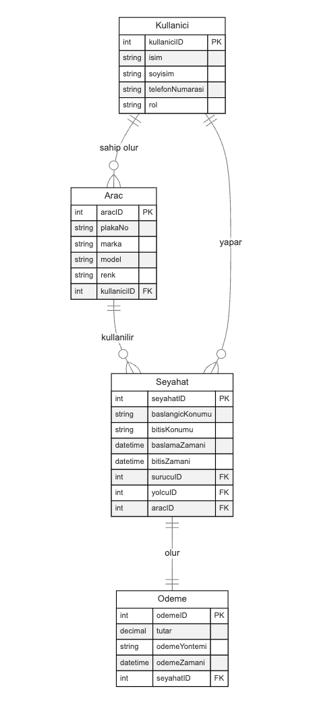

## **2. ER (Varlık-İlişki) Diyagramları**
### **2.1. ER Diyagramlarının Temel Bileşenleri**
**ER Diyagramları**, veri modelleme sürecinin kritik bir parçasıdır. Varlık-İlişki (Entity-Relationship) diyagramları, veritabanındaki varlıkları, bu varlıkların özniteliklerini ve varlıklar arasındaki ilişkileri görsel olarak temsil eder. Bu sayede, veritabanı yapısını daha iyi anlamak ve etkili bir şekilde tasarlamak mümkün olur.

#### **2.1.1. Varlıklar (Entities)**
- **Tanım:**
    - Varlıklar, bağımsız olarak tanımlanabilen nesneler veya kavramlardır. Gerçek dünyadan alınmış, veritabanında depolanacak bilgi parçalarını temsil ederler.
- **Özellikler:**
    - **İsimlendirme:** Varlık isimleri genellikle tekil isimlerle ifade edilir (örneğin, Kullanıcı, Araç, Seyahat).
    - **Varlık Türleri:** Temel varlıklar ve zayıf varlıklar.
- **Örnekler (C2C Taksi Uygulaması):**
    - **Kullanıcı (User):** Uygulamayı kullanan sürücü ve yolcuları temsil eder.
    - **Araç (Vehicle):** Sürücülerin kullandığı araçları temsil eder.
    - **Seyahat (Ride):** Gerçekleşen yolculukları temsil eder.
    - **Ödeme (Payment):** Seyahatler için yapılan ödemeleri temsil eder.

#### **2.1.2. Öznitelikler (Attributes)**
- **Tanım:**
    - Öznitelikler, varlıkların sahip olduğu özelliklerdir. Her öznitelik, varlık hakkında belirli bir bilgiyi içerir.
- **Özellikler:**
    - **Basit ve Bileşik Öznitelikler:** Basit öznitelikler tek parça iken, bileşik öznitelikler birden fazla alt özniteliğe sahip olabilir (örneğin, Ad ve Soyad).
    - **Tekrarlayan ve Çok Değerli Öznitelikler:** Bazı öznitelikler birden fazla değere sahip olabilir (örneğin, bir kullanıcının birden fazla telefon numarası).
- **Örnekler (C2C Taksi Uygulaması):**
    - **Kullanıcı:**
        - KullanıcıID, İsim, Soyisim, TelefonNumarası, Rol (Sürücü/Yolcu)
    - **Araç:**
        - AraçID, PlakaNo, Marka, Model, Renk, KullanıcıID
    - **Seyahat:**
        - SeyahatID, BaşlangıçKonumu, BitişKonumu, BaşlamaZamanı, BitişZamanı, SürücüID, YolcuID
    - **Ödeme:**
        - ÖdemeID, SeyahatID, Tutar, ÖdemeYöntemi, ÖdemeZamanı

#### **2.1.3. İlişkiler (Relationships)**
- **Tanım:**
    - İlişkiler, varlıklar arasındaki bağlantıları gösterir. Bu bağlantılar, varlıklar arasında nasıl bir etkileşim veya bağlantı olduğunu ifade eder.
- **Özellikler:**
    - **İlişki Türleri:** Bir varlık ilişkisi diğerine birden fazla şekilde bağlayabilir (bire-bir, bire-çok, çok-çok).
    - **Görsel Temsil:** İlişkiler genellikle çizgilerle bağlanmış ve ilişkilerin türünü belirtmek için sembollerle gösterilir.
- **Örnekler (C2C Taksi Uygulaması):**
    - **Kullanıcı Kullanır Araç:** Bir sürücü bir veya daha fazla araca sahip olabilir.
    - **Kullanıcı Yapar Seyahat:** Yolcu ve sürücü arasında gerçekleşen seyahatler.
    - **Seyahat İçerir Ödeme:** Her seyahatin bir ödemesi olabilir.

---

### **2.2. Kardinalite ve İlişkiler**
**Kardinalite**, varlıklar arasındaki ilişkinin sayısal doğasını belirtir. Bir ilişkideki kardinalite, bir varlığın diğer varlıkla kaç kez ilişki kurabileceğini ifade eder.

#### **2.2.1. Kardinalite Türleri**
1. **Bire-Bir (1:1):** (Düz Çizgi ile Gösterilir)
    - **Tanım:** Bir varlığın bir diğer varlıkla sadece bir kez ilişki kurabildiği durumdur.
    - **Örnek (C2C Taksi Uygulaması):** Her sürücünün tek bir ehliyet belgesi olabilir.
    - **Görsel:** İki varlık arasındaki ilişkiyi temsil eden çizginin her iki ucunda da "1" işareti bulunur.
2. **Bire-Çok (1:N):** (Bir Ucu Düz, Diğer Ucu Crowfoot(Kaz Ayakları) ile Gösterilir)
    - **Tanım:** Bir varlığın birden fazla diğer varlıkla ilişki kurabildiği durumdur.
    - **Örnek:** Bir sürücünün birden fazla aracı olabilir.
    - **Görsel:** Bir varlık ile bir diğer varlık arasındaki ilişkiyi temsil eden çizginin bir ucunda "1", diğer ucunda "N" veya "*" işareti bulunur.
3. **Çok-Çok (M:N):** (Her İki Ucu Crowfoot(Kaz Ayakları) ile Gösterilir, lakin bu durum için pivot tablo gereklidir)
    - **Tanım:** Birden fazla varlığın birden fazla diğer varlıkla ilişki kurabildiği durumdur.
    - **Örnek:** Bir yolcu birçok seyahat yapabilir ve bir seyahatte birden fazla yolcu olabilir (eğer uygulama paylaşım özellikli ise).
    - **Görsel:** İki varlık arasındaki ilişkiyi temsil eden çizginin her iki ucunda da "N" veya "*" işareti bulunur.

#### **2.2.2. İlişki Dereceleri** (ER Diagramda direkt olarak gösterilmez, fakat ilişkideki varlık sayısını belirtir)
- **Tanım:** İlişkide yer alan varlıkların sayısını belirtir.
  -  **Unary (1):** Bir varlık kendi içinde (örneğin bir sosyal medya kullanıcısının kendi arkadaşlarıyla ilişkisi).
  - **Binary (2):** İki varlık arasında (örneğin bir sürücünün bir araca sahip olması).
  - **Ternary (3):** Üç varlık arasında (örneğin bir seyahatin bir sürücü ve bir yolcu tarafından gerçekleştirilmesi).
  - **N-ary (N):** N varlık arasında (örneğin bir seyahatin bir sürücü, bir yolcu ve bir araç tarafından gerçekleştirilmesi).

#### **2.2.3. Zorunluluğa Bağlı Kardinalite Gösterimi**
**Zorunluluk**, bir varlığın diğer varlıkla ilişki kurmasının gerekliliğini ifade eder.
- **Zorunlu Katılım (Mandatory Participation):** Solid Line (Düz Çizgi) ile Gösterilir
    - Bu, zorunlu ilişkiyi (mandatory relationship) ifade eder. 
    - Bir varlığın ilişkide yer almasının zorunlu olduğu durum.
    - Ana varlık silindiğinde bağlı varlık da silinir.
    - **Örnek:** Bir sürücünün bir araca sahip olması zorunludur. Sürücü silinirse araç da silinmelidir.
- **İsteğe Bağlı Katılım (Optional Participation):** Dotted Line (Kesikli Çizgi) ile Gösterilir
    - Bu, isteğe bağlı ilişkiyi (optional relationship) ifade eder.
    - Bir varlığın ilişkide yer almasının isteğe bağlı olduğu durum.
    - Ana varlık silindiğinde bağlı varlık silinmez.
    - **Örnek:** Bir yolcunun bir seyahate katılması isteğe bağlıdır. Yolcu silinirse seyahat kaydı korunabilir.

**Örnek (C2C Taksi Uygulaması):**
- **Seyahat İçerir Ödeme** ilişkisinde
  - **Zorunlu Katılım:** Her seyahatin bir ödemesi olmalıdır.
  - **İsteğe Bağlı Katılım:** Bir ödemenin bir seyahate ait olması isteğe bağlıdır.
  - **Görsel:** Seyahat ve Ödeme arasındaki ilişkiyi temsil eden çizginin bir ucunda düz çizgi, diğer ucunda kesikli çizgi bulunur.

`Seyahat -> Düz Çizgi -> İçerir -> Kesikli Çizgi -> Ödeme`
### **2.3. ER Diyagramı Çizimi**
ER diyagramları, veritabanı tasarımının görsel bir temsilidir. Aşağıda, ER diyagramı çizimi için temel adımlar ve C2C taksi uygulaması üzerinden bir örnek sunulmaktadır.

#### **2.3.1. ER Diyagramı Çizim Adımları*
1. **Varlıkları Belirleme:**
    - Sistemdeki temel varlıkları tanımlayın.
    - **Örnek:** Kullanıcı, Araç, Seyahat, Ödeme.
2. **Öznitelikleri Tanımlama:**
    - Her varlığın sahip olması gereken öznitelikleri belirleyin.
    - **Kullanıcı:** KullanıcıID, İsim, Soyisim, TelefonNumarası, Rol.
    - **Araç:** AraçID, PlakaNo, Marka, Model, Renk, KullanıcıID.
    - **Seyahat:** SeyahatID, BaşlangıçKonumu, BitişKonumu, BaşlamaZamanı, BitişZamanı, SürücüID, YolcuID.
    - **Ödeme:** ÖdemeID, SeyahatID, Tutar, ÖdemeYöntemi, ÖdemeZamanı.
3. **İlişkileri Tanımlama:**
    - Varlıklar arasındaki ilişkileri belirleyin.
    - **Kullanıcı Kullanır Araç** ilişkisi (1:N).
    - **Kullanıcı Yapar Seyahat** ilişkisi (1:N).
    - **Seyahat İçerir Ödeme** ilişkisi (1:1).
4. **Kardinaliteyi Belirleme:**
    - İlişkilerin kardinalitesini ve zorunluluğunu belirleyin ve diyagramda gösterin.
5. **Görsel Temsil:**
    - Varlıkları dikdörtgenlerle, öznitelikleri ovalarla ve ilişkileri çizgilerle temsil edin.
    - Kardinalite ve zorunluluk sembollerini ilişki çizgilerinin uçlarına ekleyin.

#### **2.3.2. C2C Taksi Uygulaması ER Diyagramı**
**Adımlar:*
1. **Varlıklar:**
    - **Kullanıcı (User)**
    - **Araç (Vehicle)**
    - **Seyahat (Ride)**
    - **Ödeme (Payment)**
2. **Öznitelikler:**
    - **Kullanıcı:**
        - KullanıcıID (INT, PK)
        - İsim (VARCHAR)
        - Soyisim (VARCHAR)
        - TelefonNumarası (VARCHAR)
        - Rol (VARCHAR)
    - **Araç:**
        - AraçID (INT, PK)
        - PlakaNo (VARCHAR)
        - Marka (VARCHAR)
        - Model (VARCHAR)
        - Renk (VARCHAR)
        - KullanıcıID (INT, FK)
    - **Seyahat:**
        - SeyahatID (INT, PK)
        - BaşlangıçKonumu (VARCHAR)
        - BitişKonumu (VARCHAR)
        - BaşlamaZamanı (DATETIME)
        - BitişZamanı (DATETIME)
        - SürücüID (INT, FK)
        - YolcuID (INT, FK)
    - **Ödeme:**
        - ÖdemeID (INT, PK)
        - SeyahatID (INT, FK)
        - Tutar (DECIMAL)
        - ÖdemeYöntemi (VARCHAR)
        - ÖdemeZamanı (DATETIME)
3. **İlişkiler:**
    - **Kullanıcı Kullanır Araç (1:N):**    
        - Bir sürücü bir veya daha fazla araca sahip olabilir.
        - Bir araç sadece bir sürücüye aittir.
    - **Kullanıcı Yapar Seyahat (1:N):**    
        - Bir yolcu birden fazla seyahat yapabilir.
        - Bir seyahat bir yolcuya aittir.
        - Bir sürücü birden fazla seyahat gerçekleştirebilir.
        - Bir seyahat bir sürücü tarafından gerçekleştirilir.
    - **Seyahat İçerir Ödeme (1:1):**    
        - Her seyahatin bir ödemesi vardır.
        - Her ödeme bir seyahate aittir.

#### **2.3.3. ER Diyagramı Örneği*
Aşağıda, C2C taksi uygulaması için oluşturulmuş örnek bir ER diyagramı bulunmaktadır:

- **Varlıklar** dikdörtgenlerle temsil edilir.
- **Öznitelikler** ovalarla gösterilir ve ilgili varlığa bağlanır.
- **İlişkiler** romblarla (elmas şekli) gösterilir ve ilişkideki varlıkları bağlar.
- **Kardinalite** ve **zorunluluk** sembolleri ilişki çizgilerinin uçlarına eklenir.

---

### **2.4. Kardinalite ve Zorunluluk Sembolleri*
ER diyagramlarında kardinalite ve zorunluluk, ilişkilerin detaylarını belirtmek için kullanılır.

- **Kardinalite Sembolleri:**
    - **1**: Bire bir ilişki.
    - **N** veya **M**: Bire çok veya çok-çok ilişki.
- **Zorunluluk Sembolleri:**
    - **|**: Zorunlu katılım.
    - **O**: İsteğe bağlı katılım.

**Örnek (C2C Taksi Uygulaması):*
- **Kullanıcı Kullanır Araç:**
    - **Sürücü tarafı:** |1 (Her araç bir sürücüye ait olmalıdır).
    - **Araç tarafı:** O*N (Bir sürücünün sıfır veya daha fazla aracı olabilir).
- **Kullanıcı Yapar Seyahat:**
    - **Yolcu tarafı:** |1 (Her seyahat bir yolcuya ait olmalıdır).
    - **Seyahat tarafı:** O*N (Bir yolcu sıfır veya daha fazla seyahat yapabilir).

---

### **2.5. ER Diyagramı Çizimi İçin İpuçları ve En İyi Uygulamalar*
- **Net ve Tutarlı İsimlendirme:**
    - Varlık ve öznitelik isimlerini anlaşılır ve tutarlı şekilde adlandırın.
- **Özniteliklerin Doğru Türde Tanımlanması:**
    - Veri türlerini doğru seçmek, veritabanının performansı ve veri bütünlüğü açısından önemlidir.
- **Anahtarların Belirlenmesi:**
    - Her varlık için benzersiz bir birincil anahtar (PK) belirleyin.
    - Yabancı anahtarlar (FK) aracılığıyla ilişkileri tanımlayın.
- **İlişkilerin Doğru Tanımlanması:**
    - İlişkilerin kardinalite ve zorunluluklarını doğru belirleyin.
- **Görsel Temizliği Sağlama:** 
    - Diyagramınızı sade ve okunabilir tutun.
- **Modüler Yaklaşım:**
    - Büyük ve karmaşık veri modellerini küçük parçalara ayırarak yönetilebilir hale getirin.

---

### **2.6. ER Diyagramı Çizimi İçin Araçlar ve Teknolojiler**

ER diyagramları çizmek için kullanabileceğiniz bazı araçlar şunlardır:
- **Lucidchart:**
    - Bulut tabanlı, kullanıcı dostu bir diyagram oluşturma aracıdır.
- **draw.io (diagrams.net):**
    - Ücretsiz ve açık kaynaklı bir diyagram oluşturma aracıdır.
- **MySQL Workbench:**
    - MySQL veritabanları için entegre bir modelleme aracıdır.
- **Microsoft Visio:**
    - Güçlü bir diyagram ve çizim aracıdır.

---

### **2.7. ER Diyagramı Çiziminde Sık Karşılaşılan Hatalar ve Çözümleri**

- **Aşırı Karmaşıklık:**
    - **Çözüm:** Diyagramı sade tutun ve gerektiğinde modüler hale getirin.
- **Tutarsız İsimlendirme:**
    - **Çözüm:** İsimlendirme standartları belirleyin ve bunlara uyun.
- **Yanlış Kardinalite Gösterimi:**
    - **Çözüm:** Kardinalite ve zorunluluk sembollerini doğru kullanın.
- **Eksik veya Fazla Öznitelik:**
    - **Çözüm:** Veri gereksinimlerini iyi analiz edin ve sadece gerekli öznitelikleri ekleyin.
- **İlişkilerin Doğru Tanımlanmaması:**
    - **Çözüm:** İlişkileri net bir şekilde belirleyin ve doğru şekilde temsil edin.

---

### **2.8. Örnek ER Diyagramı**

**C2C Taksi Uygulaması için Tamamlanmış ER Diyagramı:*
_(Not: Görsel temsil için bir çizim aracı kullanarak diyagramı oluşturabilirsiniz.)_

**Açıklama:*
- **Kullanıcı** varlığı, **Seyahat** varlığı ile iki farklı ilişkiye sahiptir    
    - **Yapar** (Yolcu olarak)
    - **Gerçekleştirir** (Sürücü olarak)
- **Araç** varlığı, **Kullanıcı** varlığı ile bire-çok ilişkiye sahiptir. 
- **Seyahat** varlığı, **Ödeme** varlığı ile bire-bir ilişkiye sahiptir. 
- **Kardinalite** ve **zorunluluk** sembolleri doğru şekilde belirtilmiştir.