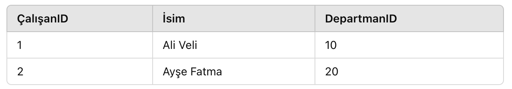
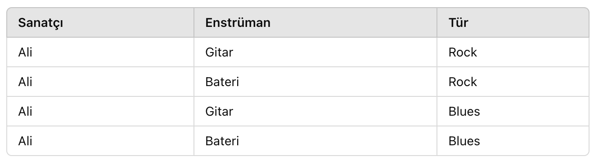

## **3. SQL Tasarım Kuralları ve Normalizasyon**
Veritabanı tasarımı, verilerin etkin bir şekilde depolanması, yönetilmesi ve erişilmesi için kritik bir rol oynar. İyi bir veritabanı tasarımı, veri bütünlüğünü korur, performansı artırır ve bakım maliyetlerini azaltır. Bu bölümde, SQL tasarım kuralları ve normalizasyon kavramlarını detaylı bir şekilde ele alacağız.

### **3.1. Veritabanı Tasarım Kuralları**
Veritabanı tasarımında dikkate alınması gereken temel kurallar şunlardır:

#### **3.1.1. Veri Bütünlüğü**
Veri bütünlüğü, verilerin doğruluğunu ve tutarlılığını korumak için uygulanan kısıtlamaları ifade eder. Veri bütünlüğünü sağlamak için aşağıdaki unsurlar kullanılır:

- **Birincil Anahtarlar (Primary Keys):**
    - Her tabloda, satırları benzersiz bir şekilde tanımlayan bir birincil anahtar olmalıdır.
    - **Örnek:** "Müşteri" tablosunda "MüşteriID" birincil anahtar olarak kullanılabilir.
- **Yabancı Anahtarlar (Foreign Keys):**
    - Tablolar arasındaki ilişkileri tanımlamak için kullanılır.
    - Yabancı anahtarlar, başka bir tablodaki birincil anahtara referans verir.
    - **Örnek:** "Sipariş" tablosunda "MüşteriID" yabancı anahtar olarak "Müşteri" tablosundaki "MüşteriID"ye referans verir.
- **Benzersizlik ve Doğruluk Kısıtlamaları:**
    - **UNIQUE** kısıtlamaları, bir sütundaki değerlerin benzersiz olmasını sağlar.
    - **NOT NULL** kısıtlamaları, bir sütunun boş bırakılamayacağını belirtir.
    - **CHECK** kısıtlamaları, bir sütundaki değerlerin belirli bir koşulu sağlamasını zorunlu kılar.

#### **3.1.2. Şema Tasarımı**
Şema tasarımı, veritabanındaki tabloların ve ilişkilerin nasıl yapılandırılacağını belirler. İyi bir şema tasarımı için aşağıdaki unsurlara dikkat edilmelidir:

- **Tablo ve Alan İsimlendirme Standartları:**
    - Anlamlı ve anlaşılır isimler kullanın.
    - İsimlendirmede tutarlılık sağlayın (örneğin, tüm tablo isimleri tekil veya çoğul olabilir, ancak karıştırılmamalıdır).
    - **Örnek:** "Müşteri", "Sipariş", "Ürün" gibi açık ve net tablo isimleri kullanın.
- **Veri Tiplerinin Doğru Seçimi:**
    - Sütunlar için uygun veri tiplerini seçmek, veritabanının performansını ve veri bütünlüğünü etkiler.
    - **Örnek:** Tarih bilgileri için DATE veya DATETIME veri tiplerini kullanın; metinler için VARCHAR veya TEXT kullanın.
- **İlişkilerin Doğru Tanımlanması:**
    - Tablolar arasındaki ilişkileri net bir şekilde belirleyin (bire-bir, bire-çok, çok-çok).
    - İlişkiler için uygun yabancı anahtarlar ve kısıtlamalar ekleyin.

---

### **3.2. Normalizasyon**
Normalizasyon, veritabanı tasarımında verilerin organize edilmesi için kullanılan bir süreçtir. Amaç, veri tekrarlanmasını azaltmak, veri bütünlüğünü sağlamak ve anormallikleri önlemektir.

#### **3.2.1. Normalizasyonun Amacı**
- **Veri Tekrarlanmasını Azaltmak:**
    - Verileri mümkün olduğunca atomik hale getirerek, aynı verinin birden fazla yerde depolanmasını önler.
- **Veri Bütünlüğünü Sağlamak:**
    - Veri tutarsızlıklarını ve hatalarını önler.
    - Verilerin güncel ve doğru kalmasını sağlar.
- **Anormallikleri Önlemek:**
    - **Güncelleme Anormallikleri:** Veri değişikliklerinin tüm ilgili yerlerde yapılmaması durumunda ortaya çıkan tutarsızlıklar.
    - **Ekleme Anormallikleri:** Yeni veri eklerken zorunlu olmayan alanların olmaması nedeniyle yaşanan sorunlar.
    - **Silme Anormallikleri:** Veri silindiğinde, istenmeyen başka verilerin de silinmesi durumu.

#### **3.2.2. Normal Formlar**
Normalizasyon süreci, veritabanının belirli normal formlara uygun olarak yapılandırılmasını içerir. Başlıca normal formlar şunlardır:

##### **a. Birinci Normal Form (1NF)**
- **Tanım:**
    - Her tablo hücresi tek bir değere sahip olmalıdır (atomik olma).
    - Tabloda yinelenen sütunlar veya gruplar olmamalıdır.
- **Amaç:**
    - Verilerin atomik hale getirilmesi ve tekrarlanan veri gruplarının kaldırılması.
- **Örnek:**
    - **Hatalı Tasarım:
    

    -  **Sorun:**
        - Bir müşterinin birden fazla telefon numarası olduğunda, ek sütunlar eklenerek veri tutulmuş.
        - Bu yaklaşım, yeni bir telefon numarası eklemek için tablo yapısının değiştirilmesini gerektirir.
- **Doğru Tasarım:**
    - **Müşteri** tablosu:
        

    - **MüşteriTelefon** tablosu:
        

-  **Açıklama:**    
    - Telefon numaraları ayrı bir tabloda tutulur ve her telefon numarası için ayrı bir satır oluşturulur.
    - Böylece, veriler atomik hale gelir ve 1NF sağlanır.

##### **b. İkinci Normal Form (2NF)**
- **Tanım:**
    - Tablonun 1NF'de olması gerekir.
    - Her bir öznitelik, birincil anahtarın tamamına tam bağımlı olmalıdır (kısmi bağımlılık olmamalı).
- **Amaç:**
    - Bileşik birincil anahtarın parçalarına bağımlı olan öznitelikleri ayırmak.
- **Örnek:**
    - **Hatalı Tasarım:**
        **SiparişDetay** tablosu:
        

    - **Sorun:**
        - _ÜrünAdı_, sadece _ÜrünID_'ye bağımlıdır, ancak _SiparişID_ ile ilgisi yoktur.
        - Bu durum, kısmi bağımlılığa yol açar ve 2NF ihlal edilir.
    - **Doğru Tasarım:**
        - **SiparişDetay** tablosu:
            

        - **Ürünler** tablosu:
            

    - **Açıklama:**
        - _ÜrünAdı_, _ÜrünID_'ye tam bağımlı hale gelir ve ayrı bir tabloda tutulur.
        - Böylece, kısmi bağımlılıklar ortadan kalkar ve 2NF sağlanır.
##### **c. Üçüncü Normal Form (3NF)**
- **Tanım:**
    - Tablonun 2NF'de olması gerekir.
    - Anahtar olmayan öznitelikler, diğer anahtar olmayan özniteliklere bağımlı olmamalıdır (transitif bağımlılık olmamalı).
- **Amaç:**
    - Transitif bağımlılıkları ortadan kaldırarak veri tutarsızlıklarını önlemek.
- **Örnek:**
    - **Hatalı Tasarım:**
        **Çalışan** tablosu:
            

    - **Sorun:**
        - _DepartmanAdı_, _DepartmanID_'ye bağımlıdır, ancak _DepartmanID_ de _ÇalışanID_'ye bağımlıdır.
        - Bu durum transitif bağımlılığa yol açar ve 3NF ihlal edilir.
    - **Doğru Tasarım:**
        - **Çalışan** tablosu:
            

        - **Departman** tablosu:
            

    - **Açıklama:** 
        - _DepartmanAdı_, _DepartmanID_'ye tam bağımlı hale gelir ve ayrı bir tabloda tutulur.
        - Transitif bağımlılıklar ortadan kalkar ve 3NF sağlanır.
### **3.3. İleri Düzey Normalizasyon**

Bazı durumlarda, veritabanını daha da optimize etmek için ileri düzey normalizasyon formları kullanılır.
#### **3.3.1. Boyce-Codd Normal Formu (BCNF)*
- **Tanım:** 
    - Her determinant, aday anahtar olmalıdır.
    - BCNF, 3NF'nin bir genellemesidir ve daha sıkı kurallar içerir.
- **Örnek:**
    - **Hatalı Tasarım:**
        - **DersAtama** tablosu:    
          

    - **Sorun:**
        - _ÖğretmenAdı_, sadece _ÖğretmenID_'ye bağımlıdır, ancak _ÖğretmenID_ aday anahtar değildir.
        - Bu durum BCNF ihlaline yol açar.
    - **Doğru Tasarım:**
        - **DersAtama** tablosu:
          

        - **Öğretmen** tablosu:
          

      - **Açıklama:**
        - _ÖğretmenAdı_, _ÖğretmenID_'ye tam bağımlı hale gelir ve ayrı bir tabloda tutulur.
        - Tüm determinantlar aday anahtar olur ve BCNF sağlanır.
#### **3.3.2. Dördüncü Normal Form (4NF)**
- **Tanım:**
    - Bir tablo, çoklu bağımsız çok-değerli bağımlılıklar içermemelidir.
    - 4NF, bir tabloda tek bir çok-değerli bağımlılık olmasını gerektirir.
- **Örnek:**
    - **Hatalı Tasarım:**
        - **SanatçıEser** tablosu:
            

    - **Sorun:**
        - _Sanatçı_ ile _Enstrüman_ ve _Sanatçı_ ile _Tür_ arasında bağımsız çok-değerli bağımlılıklar vardır.
        - Bu durum 4NF ihlaline yol açar.
    - **Doğru Tasarım:**
        - **SanatçıEnstrüman** tablosu:
            

        - **SanatçıTür** tablosu:
            

    - **Açıklama:**
        - Çok-değerli bağımlılıklar ayrı tablolarda tutulur.
        - 4NF sağlanır.
        - 
---
### **3.4. Normalizasyonun Faydaları ve Dikkat Edilmesi Gerekenler**
#### **3.4.1. Faydaları**
- **Veri Tutarlılığı:**
    - Veri tutarsızlıkları ve anormallikleri önlenir.
    - Güncellemeler ve silmeler daha güvenli hale gelir.
- **Depolama Verimliliği:**
    - Veri tekrarı azaltıldığı için depolama alanı verimli kullanılır.
- **Bakım Kolaylığı:**
    - Veritabanının yönetimi ve bakımı daha kolay hale gelir.
#### **3.4.2. Dikkat Edilmesi Gerekenler*
- **Performans Etkisi:**
    - Aşırı normalizasyon, çok sayıda tablo ve karmaşık sorgulara yol açabilir.
    - Performans ihtiyaçlarına göre denge sağlanmalıdır.
- **İhtiyaçlara Uygunluk:**
    - Her proje için en uygun normalizasyon seviyesini belirlemek önemlidir.
    - Bazen denormalizasyon (bilinçli veri tekrarı) performansı artırabilir.
- **Unutulmaması Gerekenler:**
    - **Veri Bütünlüğünü Sağlayın:**
        - Birincil ve yabancı anahtarlar, benzersizlik ve doğruluk kısıtlamaları kullanarak verilerin tutarlı kalmasını sağlayın.
    - **Normalizasyon İlkelerine Uyun:**
        - Veri tekrarlanmasını azaltın, anormallikleri önleyin ve uygun normal formları uygulayın.
    - **Dengeyi Sağlayın:**
        - Performans ve veri bütünlüğü arasında denge kurun.
        - Gerektiğinde denormalizasyon tekniklerini kullanın.